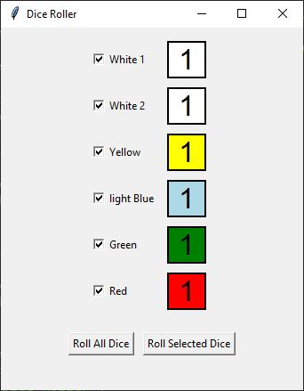
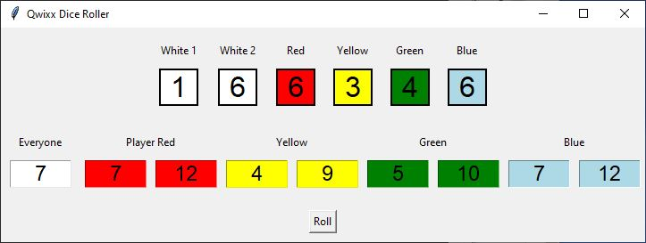

# Dice Roller

## Prompts (ChatGPT 4o)

### 1. Create a tkinter dice rolling application that will display two white dice, a yellow dice, a blue dice, a green dice, and a red dice.  Allow all dice to be rolled at the same time.  Allow any selection of dice to be rolled.

### 2. Update the dice roller to always roll all of the dice.

### 3. Add a label that gives totals for combining the dice values in the following ways: white 1 + white 2, red + white 1, red + white 2, blue + white 1, blue + white 2, green + white 1, green + white 2, yellow + white 1, yellow + white 2.

### 4. Make the totals appear to the right of the dice.  Make the total bold for each.

### 5. Update the dice roller to match the attached sketch.  The approach shows the dice combinations in textboxes rather than a label.

### 6. Update the code to show the red,  yellow, green, and blue dice as in the previous version and shown in sketch attachment.  Show results in the horizontal format shown in the sketch.

### 8. Update the total boxes to be the color of the dice that form the totals.  Use white for the first box and then the other color any other combination with white.

### 7. Looks good, except please add the labels for the totals in the second row.  Use the labels from the sketch.

### 9. The backgrounds are set in code ie. bg= "blue", but the colors are not displaying for  the totals?

-- end --

      
